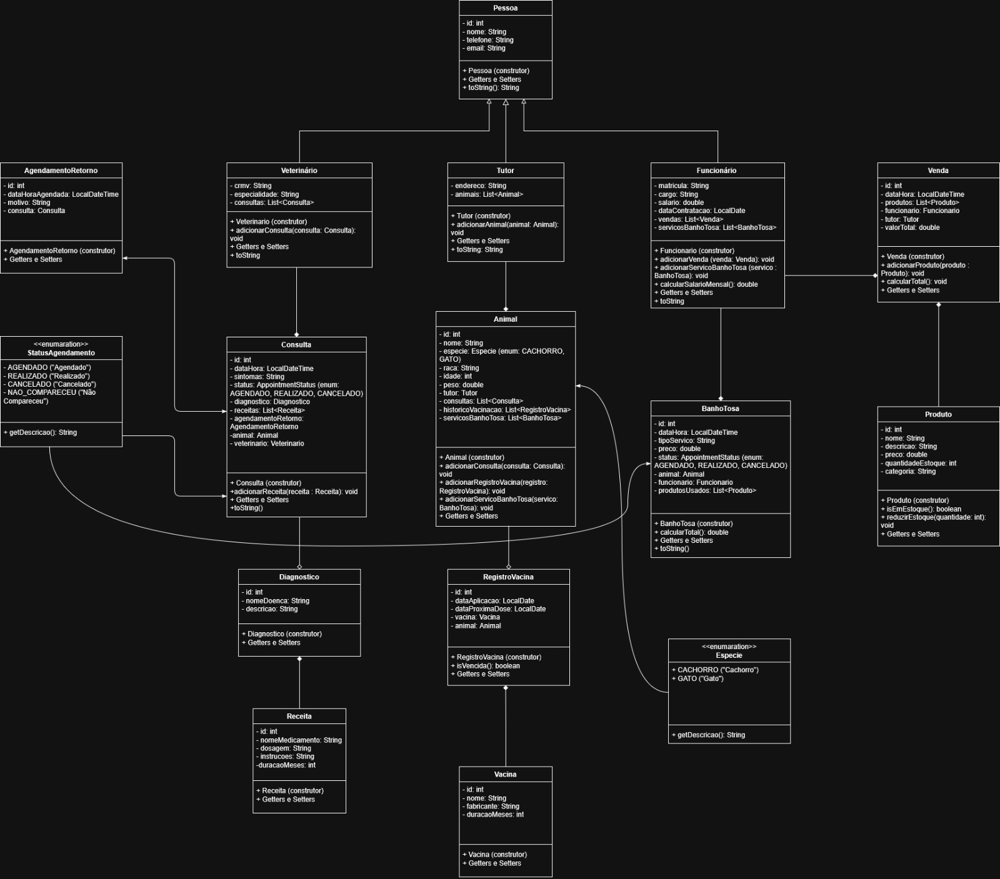

# Clinica Veterinaria - Sistema de Gestao

Sistema completo de gestao para clinicas veterinarias desenvolvido em Java com interface grafica (Swing).

## Sobre o Projeto

O **Clinica Veterinaria** e um sistema desktop projetado para gerenciar todas as operacoes de uma clinica veterinaria, incluindo:

- **Consultas** e agendamentos de retorno
- **Prontuario eletronico** de animais
- **Registro de vacinas** e historico de vacinacao
- **Servicos de banho e tosa**
- **Diagnostico** e receitas medicas
- **Vendas** de produtos e controle de estoque
- **Cadastro** de tutores, veterinarios e funcionarios

## Modelo de Dominio

O sistema utiliza heranca com a classe `Pessoa` como base para todas as entidades humanas:

| Entidade | Atributos Principais | Relacionamentos |
|----------|---------------------|-----------------|
| **Pessoa** (classe base) | id, nome, telefone, email | Base para Veterinario, Tutor, Funcionario |
| **Veterinario** | crm, especialidade | Lista de consultas |
| **Tutor** | endereco | Lista de animais |
| **Funcionario** | matricula, cargo, salario, dataContratacao | Vendas, servicos de banho/tosa |
| **Animal** | nome, especie, raca, idade, peso | Tutor, consultas, vacinas, banho/tosa |
| **Consulta** | dataHora, sintomas, status, diagnostico | Animal, veterinario, receitas, agendamentoRetorno |
| **Diagnostico** | nomeDoenca, descricao | Associado a consulta |
| **Receita** | nomeMedicamento, dosagem, instrucoes, duracaoMeses | Associado a consulta |
| **RegistroVacina** | dataAplicacao, dataProximaDose | Animal, vacina |
| **Vacina** | nome, fabricante, duracaoMeses | Registros de vacinacao |
| **BanhoTosa** | tipoServico, preco, status | Animal, funcionario, produtos |
| **Venda** | dataHora, valorTotal | Produtos, funcionario, tutor |
| **Produto** | nome, descricao, preco, quantidadeEstoque, categoria | Utilizado em vendas e banho/tosa |
| **AgendamentoRetorno** | dataHoraAgendada, motivo | Consulta associada |

## Diagrama de Classes



## Enums

| Enum | Valores |
|------|---------|
| **Especie** | `CACHORRO`, `GATO` |
| **StatusAgendamento** | `AGENDADO`, `REALIZADO`, `CANCELADO`, `NAO_COMPARECEU` |
| **AppointmentStatus** | `AGENDADO`, `REALIZADO`, `CANCELADO` |

## Arquitetura

```
┌─────────────────────────────────────────────────┐
│                   GUI (Java Swing)               │
│  12 paineis: Animal, Tutor, Consulta, etc.       │
├─────────────────────────────────────────────────┤
│              Service (SistemaService)             │
│  Logica de negocio e operacoes CRUD              │
├─────────────────────────────────────────────────┤
│                 Model (Entidades)                 │
│  14 classes de dominio + 2 enums                 │
├─────────────────────────────────────────────────┤
│              Persistencia (.dat)                  │
│  Armazenamento em arquivo binario                │
└─────────────────────────────────────────────────┘
```

## Estrutura do Projeto

```
src/com/clinica/
├── Main.java                    # Ponto de entrada
├── gui/                         # Interface grafica
│   ├── MainFrame.java           # Janela principal
│   ├── AnimalPanel.java         # Cadastro de animais
│   ├── TutorPanel.java          # Cadastro de tutores
│   ├── VeterinarioPanel.java    # Cadastro de veterinarios
│   ├── FuncionarioPanel.java    # Cadastro de funcionarios
│   ├── ConsultaPanel.java       # Gestao de consultas
│   ├── DiagnosticoPanel.java    # Diagnosticos
│   ├── RegistroVacinaPanel.java # Controle de vacinas
│   ├── BanhoTosaPanel.java      # Servicos banho/tosa
│   ├── ProdutoPanel.java        # Produtos
│   ├── VendaPanel.java          # Vendas
│   ├── VacinaPanel.java         # Cadastro de vacinas
│   └── AgendamentoRetornoPanel.java # Agendamentos
├── model/                       # Entidades de dominio
│   ├── Pessoa.java              # Classe base
│   ├── Animal.java
│   ├── Veterinario.java
│   ├── Tutor.java
│   ├── Funcionario.java
│   ├── Consulta.java
│   ├── Diagnostico.java
│   ├── Receita.java
│   ├── RegistroVacina.java
│   ├── Vacina.java
│   ├── BanhoTosa.java
│   ├── Venda.java
│   ├── Produto.java
│   ├── AgendamentoRetorno.java
│   ├── Especie.java             # Enum
│   └── AppointmentStatus.java   # Enum
├── service/
│   └── SistemaService.java      # Logica de negocio
└── util/
    └── GeradorId.java           # Geracao de IDs
```

## Como Executar

1. **Compilar o projeto:**
   ```bash
   compilar.bat
   ```

2. **Executar a aplicacao:**
   ```bash
   java -cp src com.clinica.Main
   ```

## Tecnologias Utilizadas

- **Linguagem:** Java
- **Interface Grafica:** Java Swing
- **Persistencia:** Arquivo binario (.dat)
- **Build:** Script batch (compilar.bat)

---

## Integrantes

- **Yure Gabriel Alves Cruz** - [yuregabri](https://github.com/yuregabri)
- **Lidia Emanuela Barros**
- **Breno Henrique**
- **Gabriel Lucas Almeida**
